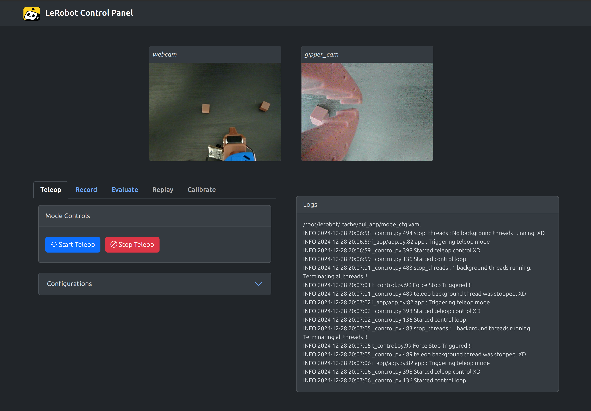

# LeRobot Control Panel App

<p align="center">
  <picture>
    <source media="(prefers-color-scheme: dark)" srcset="static/images/demo-screenshot.png">
    <source media="(prefers-color-scheme: light)" srcset="static/images/demo-screenshot.png">
    
  </picture>
  <br/>
  <br/>
</p>

This README provides instructions on how to set up and run the GUI app for the LeRobot project.

## Table of Contents

- [Project Objective](#project-objective)
- [Prerequisites](#prerequisites)
- [Running the App](#running-the-app)
- [Walkthrough](#walkthrough)
- [Contributing](#contributing)

## Project Objective

The main objectives of creating this GUI app for the lerobot package are:

1. **Ease of Use and User-Friendly Interface**: Provide an easy and efficient way to use the lerobot package without needing to enter commands in the command prompt, offering a user-friendly interface that simplifies the interaction with the robot and its control mechanisms.
2. **Faster Data Collection and Evaluation**: Enable faster data collection and evaluation processes, reducing the hassle of manual command entry.
3. **Experimentation**: Allow users to try different policies and settings, and iterate through various experiments more quickly.
4. **Real-Time Monitoring**: Facilitate real-time monitoring and control of the robot, enhancing the overall user experience.

## Prerequisites

1. Make sure to install all the required dependencies for the lerobot package.
2. Install the required packages for the GUI from the `requirements.txt` file:
    ```bash
    pip install -r lerobot/gui_app/requirements.txt
    ```

## Running the App

To run the GUI app, execute the following command:
```bash
python lerobot/gui_app/app.py
```

The app will be available at `http://0.0.0.0:8000`.
Note: You can use the same keyboard shotcuts as indicated in LeRobot package usage.


## Walkthrough

```
.
└── gui_app   
    ├── configs              # contains yaml config files for robot control modes
    ├── static               # contains static files like JavaScript and images
    │   ├── images           # Image files used in the app
    │   ├── js               # JavaScript files for app functionality
    ├── templates            # contains HTML templates for the app
    │   ├── control_panel.html  # main control panel template
    │   ├── teleop.html         # teleoperation controls template
    │   ├── record.html         # recording controls template
    │   ├── eval.html           # evaluation controls template
    ├── app.py               # main application script to run the GUI
    ├── requirements.txt     # dependencies required for the GUI app
    ├── robot_control.py     # modified robot logic from lerobot to control real robot 
    ├── utils.py             # utility functions used across the app
    └── README.md            # this README file
```

## Contributing

Contributions are welcomed!